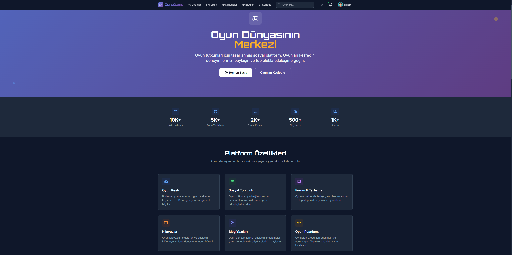
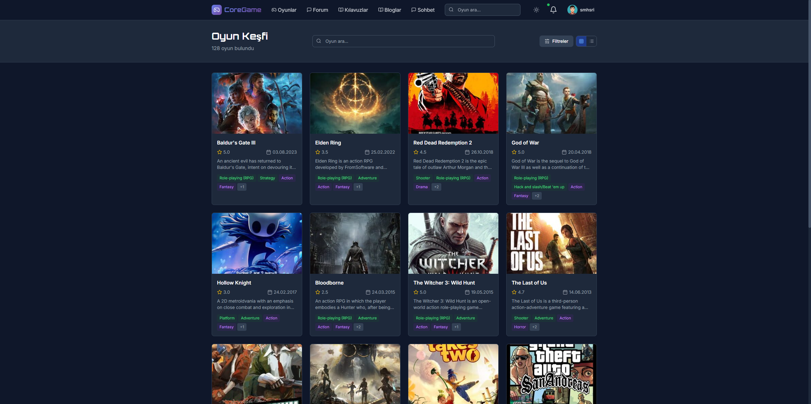
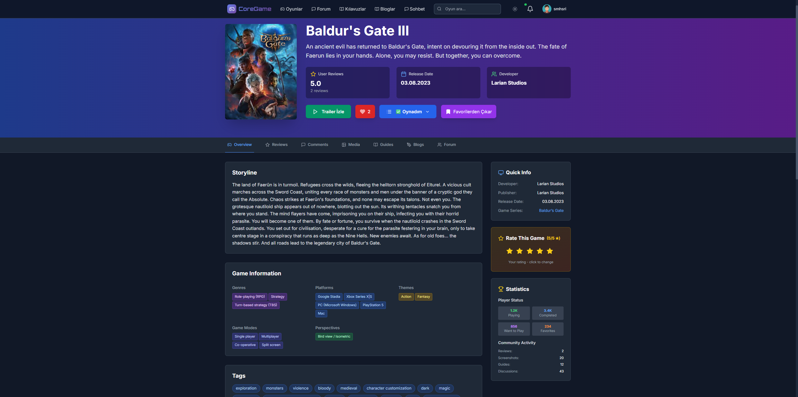
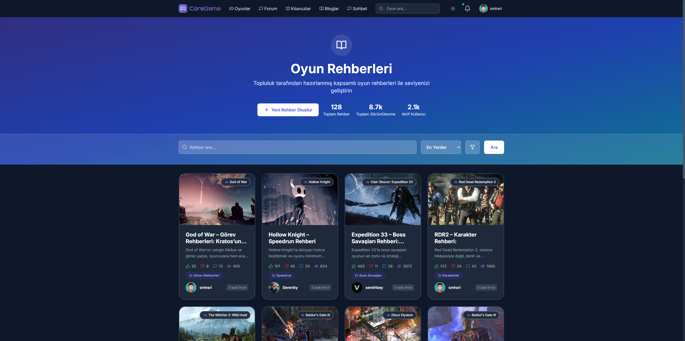
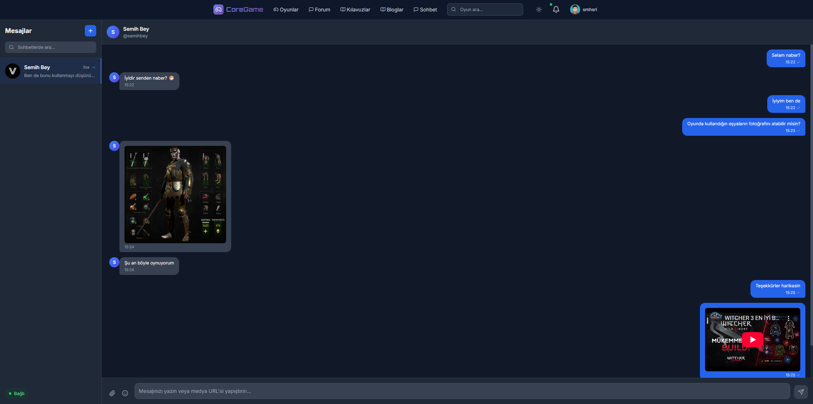
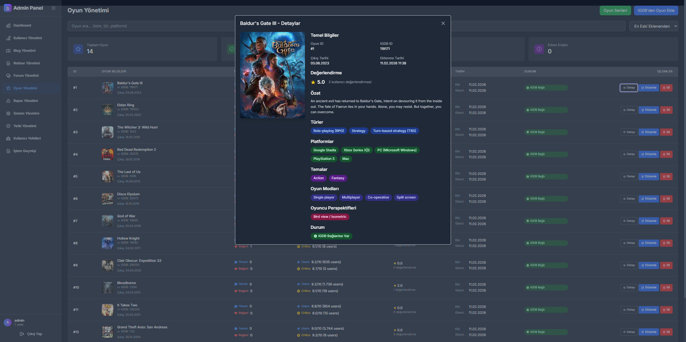

# 🎮 CoreGame – Gaming Community Platform

**CoreGame**, oyunseverler için geliştirilmiş kapsamlı bir gaming community platformudur.  
Kullanıcılar oyunları keşfedebilir, yorum yapabilir, forumlarda tartışabilir, rehberler hazırlayabilir ve toplulukla etkileşime girebilir.

---

## 🚀 Proje Kapsamı

### Core Özellikler
```bash
├── Kullanıcı Yönetimi
│   ├── Kayıt / Giriş Sistemi ✅
│   ├── Profil Yönetimi (Avatar, Bio, Sosyal) ✅
│   ├── Roller (Admin, Moderator, User) ✅
│   ├── Email Doğrulama & Şifre Sıfırlama ✅
│   └── İki Faktörlü Doğrulama (2FA)
│
├── Oyun Yönetimi
│   ├── IGDB API Entegrasyonu ✅
│   ├── Oyun Kategorileri & Etiketleme ✅
│   ├── Platform Desteği (PC, PS, Xbox, Switch, Mobile) ✅
│   ├── Puanlama Sistemi (1–10) ✅
│   └── Oyun Karşılaştırma & Filtreleme
│
├── Sosyal & Forum
│   ├── Yorum & Nested Reply Sistemi ✅
│   ├── Like/Dislike & Spoiler Gizleme ✅
│   ├── Forum Kategorileri & Etiketleme ✅
│   ├── Q&A (Best Answer seçimi) ✅
│   └── Real-time Chat (SignalR) ✅
│
├── İçerik Yönetimi
│   ├── Oyun Rehberleri (Walkthrough, Tips, Tricks) ✅
│   ├── Rich Text Editor & Media Upload ✅
│   ├── Blog Yazıları ✅
│   └── Topluluk Listeleri (Top 10, Favoriler)
│
├── Kişiselleştirme
│   ├── Oyun Listeleri (Oynadım, Oynamak İstiyorum, Favorilerim…) ✅
│   ├── İndirim Takip Sistemi (Steam, Epic, GOG)
│   ├── Çıkış Tarihi Hatırlatıcıları
│   └── Fiyat Düşüş Bildirimleri
│
├── Sosyal Etkileşim
│   ├── Arkadaş Ekleme / Takip Sistemi ✅
│   ├── Mesajlaşma ✅
│   ├── Activity Feed ✅
│   ├── Rozetler & XP Sistemi
│   └── Leaderboard & Challenge’lar
│
└── Gelişmiş Özellikler
    ├── Elasticsearch ile Gelişmiş Arama
    ├── ML Tabanlı Oyun Önerileri
    ├── Progressive Web App (PWA)
    └── Güvenlik (JWT, Rate Limiting, CSRF, XSS)
```

🏗️ Solution Mimarisi
```bash

CoreGameApp/
├── AdminLayer/
│   ├── Controllers/
│   ├── Properties/
│   └── Views/
│
├── APILayer/
│   ├── Controllers/
│   ├── Extensions/
│   ├── Hubs/
│   ├── Middleware/
│   ├── Properties/
│   └── Services/
│
├── ApplicationLayer/
│   ├── DTOs/
│   ├── Mappings/
│   ├── Services/
│   ├── Utils/
│   └── Validators/
│
├── DomainLayer/
│   ├── Entities/
│   ├── Enums/
│   ├── ExternalApiModels/
│   └── Interfaces/
│
├── InfrastructureLayer/
│   ├── Attributes/
│   ├── Data/
│   ├── ExternalApiServices/
│   ├── Middleware/
│   ├── Migrations/
│   ├── Repositories/
│   └── Services/
│
├── Scripts/
│   ├── GenerateSlugsForExistingData.cs
│   └── GenerateSlugsForExistingGames.cs
│
├── WebLayer/
│   ├── ClientApp/
│   ├── Hubs/
│   ├── Properties/
│   └── Services/
```

⚙️ Kullanılan Teknolojiler

```bash
Backend
├── .NET 9 (ASP.NET Core)
├── Entity Framework Core (SQL Server)
├── Identity & JWT
├── MediatR (CQRS)
├── AutoMapper
└── FluentValidation

Frontend
├── ASP.NET Core MVC
├── Razor Views
└── Bootstrap

Diğer
├── SignalR (Real-time)
└── Elasticsearch (Advanced Search)
```

🎯 CoreGame’in amacı;

Oyunseverlere tam teşekküllü bir topluluk platformu sağlamak,
Kullanıcıların oyun deneyimlerini paylaşabileceği, rehberler hazırlayabileceği bir ortam yaratmak,
Modern yazılım mimarisi, temiz kod ve ölçeklenebilir yapı ile sektörel bir örnek oluşturmak.

## 📸 Screenshots

### 🏠 Home Page


---

### 📂 Other Pages

<p align="center">
  
  
</p>

<p align="center">
  
  
</p>

<p align="center">
  
  
</p>

---

Daha fazla ekran görüntüsü için [`screenshots`](screenshots) klasörünü inceleyebilirsiniz.

